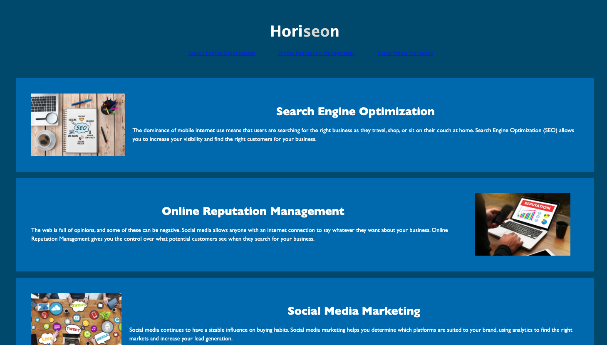
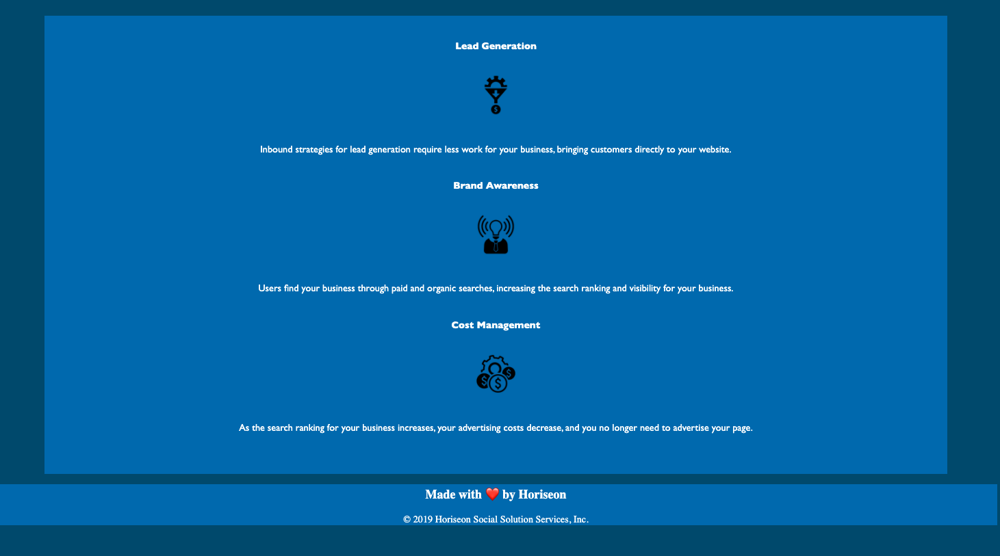

# HomeworkW1

This is a webpage meets accessibility standards made in Html and CSS .

## Contents

The app is composed of 2 pages, index.html and style.css. It also has images in the img folder

## User Story

AS A marketing agency
I WANT a codebase that follows accessibility standards
SO THAT our own site is optimized for search engines

## Built With

* [VScode](https://code.visualstudio.com/) - The editor of choice
* [Terminal](https:///) - What would we do without our bash?

#### Final Interface

### Licence

* No licence due to nature of the product.

### Link to the App

<a href=".">Link to the App</a>

## Authors

* **Michael Watt**

Contact information

GitHub: [@Michaelmw17](https://github.com/Michaelmw17/w8homework)

Email: Michaelmw17@outlook.com

## Acknowledgments

* Bootstrap
